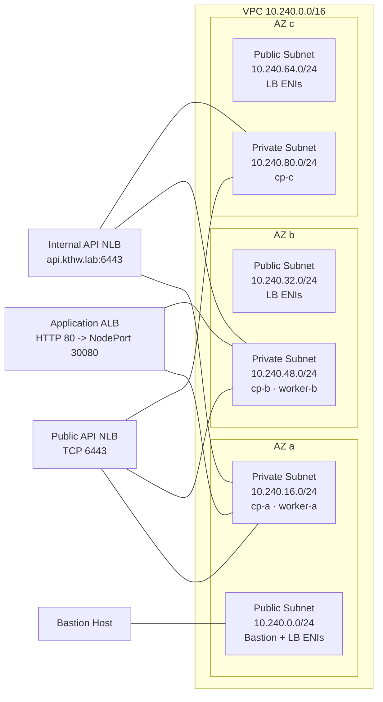
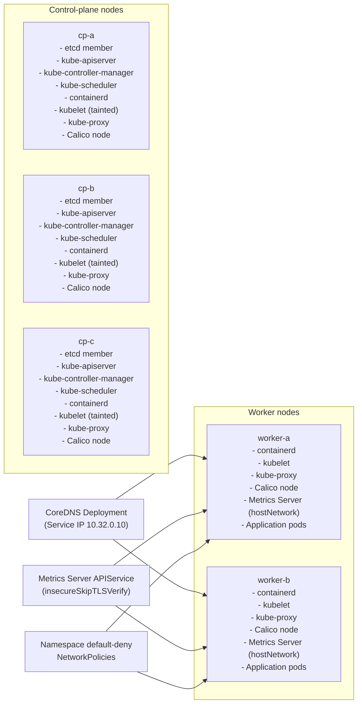

# Kubernetes the Hard Way — Target Architecture

This document captures the desired end-state architecture for the cluster we built by hand on AWS. It explains the topology, core components, access patterns, and key design decisions, all of which are grounded in the ADRs and maintained as the canonical reference for the lab.

## Cluster Topology & Availability

- **Nodes**: Three control-plane nodes and two worker nodes.
  - Control plane instances (`cp-a`, `cp-b`, `cp-c`) are distributed one per AZ to preserve quorum through the loss of an AZ or a single instance.
  - Worker capacity (`worker-a`, `worker-b`) lives in AZ a and AZ b; the AZ c worker slot is reserved for future scale-out.
  - Control-plane nodes run kubelet, kube-proxy, containerd, and Calico alongside etcd and the control-plane binaries (ADR 011). They remain tainted so application workloads stay on the workers unless explicitly scheduled.
- **Availability Zones**: `cp-a` and `worker-a` reside in AZ a, `cp-b` and `worker-b` in AZ b, and `cp-c` stands alone in AZ c.
  - AZ-aware placement keeps latencies low while maximising resilience to zonal failure.
- **Instance Sizing**: Control plane nodes use `t3.medium`; workers use `t3.small` after Chapter 2 right-sizing.
  - Provides enough memory/CPU headroom for control-plane services, Calico, and kubelet metrics scraping without overspending on worker capacity.

## Network Layout

- **VPC CIDR**: `10.240.0.0/16` dedicated to the lab to avoid overlap with corporate ranges.
- **Subnets**: Per AZ, one public subnet (load balancers, bastion) and one private subnet (control plane and workers).
  - Public subnets host the bastion, the application ALB, and public API NLB interfaces; private subnets host the EC2 nodes and the internal API NLB.
- **Routing**: Internet Gateway plus a NAT gateway for outbound package fetches. Private subnets route through the NAT while the bastion and public load balancers use the IGW directly.
- **Addressing**: Static private IPs follow ADR 002 (e.g., `cp-a 10.240.16.10`, `worker-b 10.240.48.20`).

## Kubernetes Networking Choices

- **Pod CIDR**: `10.200.0.0/16` cluster-wide; pairs cleanly with the overlay network.
- **Service CIDR**: `10.32.0.0/24` with the first IP reserved for the cluster DNS service.
- **CNI**: Calico in VXLAN mode schedules on every node, including the control plane (ADR 008, ADR 011), so ClusterIP services and aggregated APIs are reachable everywhere.
- **Kube-Proxy**: Runs in iptables mode initially with the option to move to IPVS; rules are consistent across control plane and worker nodes.
- **Calico MTU**: Defaults suffice on ENA-backed instances; documentation calls out how to adjust if workloads require jumbo frames.

## Control Plane Components

- **etcd**: Three-node cluster (v3.5.12) with TLS for peer and client traffic, colocated with the control-plane instances.
- **Kubernetes Binaries**: `kube-apiserver`, `kube-controller-manager`, `kube-scheduler`, and `kubectl` installed from upstream release tarballs. Systemd units, env files, and manifests live under version control (Chapters 4–5).
- **Node Agents on Controllers**: containerd, kubelet, and kube-proxy mirror the worker configuration (ADR 011). Controllers keep the `node-role.kubernetes.io/control-plane:NoSchedule` taint to deter general workloads while still serving metrics and overlay routes.
- **Certificates & Encryption**: kube-apiserver trusts Chapter 3 PKI assets, includes SANs for internal (`api.kthw.lab`) and public NLB hostnames, and loads the secrets-at-rest encryption config.

## Worker Stack & Platform Services

- **Worker Components**: Each worker runs containerd, kubelet, kube-proxy, and Calico. Cloud-init handles kernel modules (`overlay`, `br_netfilter`, `nf_conntrack`), sysctls, swap disablement, and base tooling (`chrony`, `conntrack`, `socat`, etc.).
- **CoreDNS**: Deployed per Chapter 9 with the service IP `10.32.0.10` and runs in the `kube-system` namespace.
- **Metrics Server**: HostNetwork deployment pinned to worker nodes with `node-role.kubernetes.io/worker` selectors (ADR 014). The aggregated API currently relies on `insecureSkipTLSVerify: true` pending a future CA bundle update.
- **NetworkPolicies**: Default-deny ingress/egress policies for the `default` namespace plus an allow-from-ingress namespace pattern (ADR 013). Namespace owners extend these policies as needed.

## Access & Tooling Strategy

- **Bastion Host**: Ubuntu 22.04 instance in the AZ a public subnet, restricted to trusted admin CIDRs. Serves as the control point for `ssh`, `scp`, and cluster tooling.
- **Internal API Access**: Private Route53 zone `kthw.lab` fronts the internal NLB at `api.kthw.lab`, used by nodes and bastion workflows (Chapter 6).
- **Public API Access**: Chapter 13 provisions a public-facing NLB with a dedicated security group that only permits administrator CIDRs. Operators consume the AWS-issued NLB DNS name via `chapter13/kubeconfigs/admin-public.kubeconfig`.
- **Admin Tooling**: `awscli`, `jq`, `kubectl`, `cfssl`, `etcdctl`, and helper scripts are installed on both local machines and the bastion. Terraform workflows live under each chapter.

## PKI & Security Posture

- **Certificate Authority**: Offline root CA with intermediate issuance handled through `cfssl`. All component certs are stored in `chapter3/pki/` with distribution manifests.
- **Client & Serving Certs**: Individual cert/key pairs for kube-apiserver (private + public SANs), etcd members, controller-manager, scheduler, kubelets (per node), kube-proxy, and the admin user. Kubelet certificates underpin node authentication for both controllers and workers.
- **RBAC**: Explicit ClusterRoleBinding maps the Chapter 3 admin identity to `cluster-admin` (ADR 013). Additional bindings follow least privilege.
- **Secrets Encryption**: Enabled by default via the apiserver encryption config distributed from Chapter 3 assets.
- **Security Groups**: Chapter 11 retains the necessary control-plane↔worker allowances for Metrics Server while keeping kubelet read-only ports disabled and limiting ingress to load balancers.

## Security Group Matrix

| Security Group | Attached To | Ingress Highlights | Egress |
| --- | --- | --- | --- |
| `kthw-bastion` | Bastion EC2 (Chapter 1) | `admin_cidr_blocks -> tcp/22 (SSH)` | `0.0.0.0/0 -> all`
| `kthw-control-plane` | Control-plane EC2 (Chapter 1) | `kthw-bastion -> tcp/22 (SSH)` `kthw-bastion -> tcp/6443 (kubectl)` `kthw-worker -> tcp/6443 (node API clients)` `VPC subnets -> tcp/6443 (internal NLB health/client traffic)` `self -> tcp/2379-2380 (etcd)` `self + kthw-worker -> tcp/10250 (kubelet)` `self -> tcp/4443 (metrics server)` `self + kthw-worker -> tcp/179 (Calico BGP)` `self + kthw-worker -> udp/4789 (Calico VXLAN)` | `0.0.0.0/0 -> all`
| `kthw-worker` | Worker EC2 (Chapter 1) | `kthw-bastion -> tcp/22 (SSH)` `kthw-control-plane -> tcp/10250 (kubelet)` `self -> tcp/10250 (worker add-ons)` `kthw-control-plane -> tcp/4443 (metrics server)` `self + kthw-control-plane -> tcp/179 (Calico BGP)` `self + kthw-control-plane -> udp/4789 (Calico VXLAN)` `kthw-ch10-alb -> tcp/30080 (nginx NodePort)` `nodeport_source_cidrs -> tcp/30000-32767 (disabled unless populated)` | `0.0.0.0/0 -> all`
| `kthw-api-nlb` | Defined for internal API NLB (Chapter 6, currently unattached) | `kthw-bastion -> tcp/6443 (reserved admin access)` | `0.0.0.0/0 -> all`
| `kthw-ch10-alb` | Application ALB (Chapter 10) | `0.0.0.0/0 -> tcp/80 (HTTP)` | `0.0.0.0/0 -> all`
| `kthw-public-api` | Public API NLB ENIs + control-plane ENIs (Chapter 13) | `admin_cidr_blocks -> tcp/6443 (public kubectl)` | `0.0.0.0/0 -> all`

## PKI & Kubeconfig Inventory

### PKI artifacts (by component)

- **Root certificate authority** (`chapter3/pki/ca/`)
  - `ca.pem` — offline root CA certificate that signs every component certificate.
  - `ca-key.pem` — private key for the root CA (kept off-cluster).
  - `ca-config.json` — cfssl signing profiles for components and kubelets.
  - `ca.csr`, `ca-csr.json` — retained request/config that produced the root CA.
- **Front-proxy CA** (`chapter3/pki/front-proxy/`)
  - `front-proxy-ca.pem` / `front-proxy-ca-key.pem` — aggregation-layer CA for front-proxy clients.
  - `front-proxy-client.pem` / `front-proxy-client-key.pem` / `front-proxy-client-csr.json` — certificate and key used by the aggregator to reach the apiserver.
- **Kube-apiserver serving material** (`chapter3/pki/apiserver/`)
  - `apiserver.pem` / `apiserver-key.pem` — TLS identity covering control-plane node IPs plus internal and public NLB hostnames.
  - `apiserver-hosts.json` — definitive SAN list consumed by regeneration scripts.
  - `apiserver.csr`, `apiserver-csr.json` — csr + config retained for auditability.
- **Controller and system clients**
  - `chapter3/pki/controller-manager/kube-controller-manager.pem` / `kube-controller-manager-key.pem` — controller manager client credential.
  - `chapter3/pki/scheduler/kube-scheduler.pem` / `kube-scheduler-key.pem` — scheduler client credential.
  - `chapter3/pki/kube-proxy/kube-proxy.pem` / `kube-proxy-key.pem` — kube-proxy client credential.
- **Per-node kubelet identities** (`chapter3/pki/kubelet/<node>/`)
  - Each node directory (`cp-a`, `cp-b`, `cp-c`, `worker-a`, `worker-b`) contains `kubelet.pem`, `kubelet-key.pem`, and the matching `csr.json` / `kubelet.csr` pair used when issuing the node certificate.
  - `kubelet-csr-template.json` captures the cfssl template applied to every node CSR.
- **Administrative and add-on clients**
  - `chapter3/pki/admin/admin.pem` / `admin-key.pem` — admin user mapped to the Chapter 11 ClusterRoleBinding.
  - `chapter3/pki/metrics-server/metrics-server.pem` / `metrics-server-key.pem` — metrics-server client identity (ADR 014).
- **Service account signing keys** (`chapter5/pki/`)
  - `service-account.key` / `service-account.pub` — RSA keypair used by the controller manager to sign and validate Kubernetes service account tokens.
- **etcd certificates** (`chapter4/pki/`)
  - `peer/<node>/peer.pem` / `peer-key.pem` — TLS identities for etcd peer-to-peer replication on each control-plane node.
  - `server/<node>/server.pem` / `server-key.pem` — etcd server certificates presented to local clients (kube-apiserver, etcdctl).
  - `client/etcd-client.pem` / `etcd-client-key.pem` — client credential bundled with bastion tooling for TLS-authenticated etcdctl operations.
- **Supporting metadata**
  - `chapter3/pki/manifest.yaml` — master manifest that drives distribution tooling and ownership assignments.
  - `chapter3/encryption/encryption-config.yaml` — secrets-at-rest encryption policy loaded by the apiserver.

### Kubeconfig files

- `chapter5/kubeconfigs/admin.kubeconfig` — bastion/admin configuration for the internal API endpoint.
- `chapter5/kubeconfigs/kube-controller-manager.kubeconfig` — systemd unit kubeconfig for the controller manager.
- `chapter5/kubeconfigs/kube-scheduler.kubeconfig` — systemd unit kubeconfig for the scheduler.
- `chapter5/kubeconfigs/cp-a-kubelet.kubeconfig`, `cp-b-kubelet.kubeconfig`, `cp-c-kubelet.kubeconfig` — kubelet configs for the control-plane nodes (ADR 011).
- `chapter7/kubeconfigs/worker-a-kubelet.kubeconfig`, `worker-b-kubelet.kubeconfig` — kubelet configs for worker nodes.
- `chapter7/kubeconfigs/kube-proxy.kubeconfig` — shared kube-proxy client configuration distributed to all nodes.
- `chapter9/kubeconfigs/metrics-server.kubeconfig` — metrics-server client configuration referencing its dedicated certificate.
- `chapter13/kubeconfigs/admin-public.kubeconfig` — admin configuration using the public NLB hostname for off-VPC access.

## External Exposure

- **Internal Control Plane Endpoint**: AWS Network Load Balancer (`kthw-api-nlb`) spans the private subnets on TCP 6443. Private Route53 alias `api.kthw.lab` targets it for in-cluster access.
- **Public Control Plane Endpoint**: A second Network Load Balancer publishes TCP 6443 to the internet with an allowlist-driven security group (ADR 016). The AWS-generated DNS name is the canonical public endpoint; certificates and kubeconfigs include this hostname.
- **Application Exposure**: Chapter 10 introduces an Application Load Balancer over the public subnets. It listens on HTTP/80 and forwards to the workers’ NodePort 30080 for the sample nginx deployment (ADR 012). No public Route53 zone is created; clients use the ALB DNS name.
- **DNS Summary**: Private DNS lives in Route53 (`kthw.lab`). Public endpoints (API NLB, ALB) rely on AWS-provided hostnames.

## Naming & Tagging Conventions

- **Hostnames**: `cp-{a,b,c}` and `worker-{a,b}` align with AZ letters for immediate fault-domain context.
- **AWS Tags**: `Project=K8sHardWay`, `Role=ControlPlane|Worker|Bastion|LoadBalancer`, and `Env=Lab` applied consistently to aid discovery and teardown.

## Operational Considerations

- **Backups & DR**: Chapter 12 captures the intended etcd snapshot and upgrade runbooks as documentation only (ADR 015); no automated snapshots run in this lab.
- **Logging & Monitoring**: OS logs remain local. Metrics Server and `kubectl top` provide basic observability; richer stacks are deferred.
- **Network Policy Hygiene**: Default-deny policies mean new namespaces should ship explicit allows. The ingress label pattern in Chapter 11 serves as the baseline.
- **Teardown Readiness**: Chapter 14 provides copy-pasteable Terraform destroy sequences and manual AWS checks rather than executable scripts (ADR 017).

## Visual Topology

### Network & AZ Layout

### Node Component Layout

